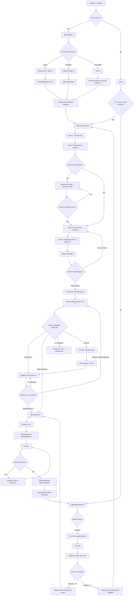
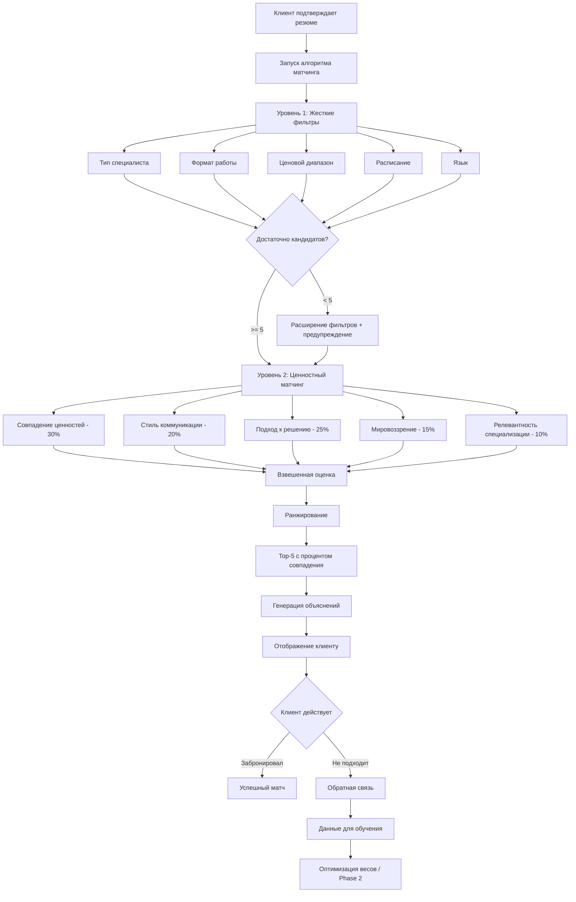
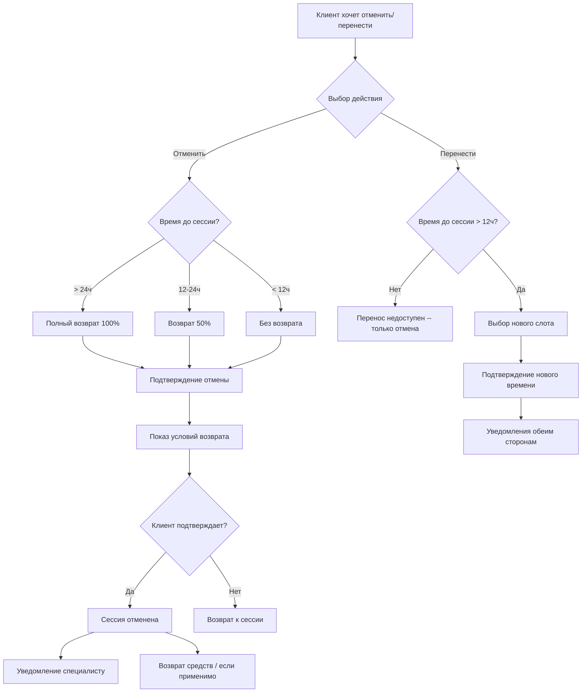

# SoulMate -- Пользовательские потоки (User Flows)

**Версия:** 1.0
**Дата:** 2026-03-03
**Автор:** UI/UX Designer

---

## 1. Основной поток клиента: От лендинга до сессии

Персоны: Марина (первый шаг), Алексей (перезагрузка карьеры).
User Stories: US-1.1 .. US-1.4, US-2.1 .. US-2.5, US-4.1 .. US-4.4, US-5.1 .. US-5.2, US-6.1

### 1.1. Диаграмма потока (Mermaid)



### 1.2. Детализация каждого шага

#### Шаг 1: Лендинг

```
Точка входа:
  - Прямой URL (soulmate.ru)
  - Реклама (контекст, таргет)
  - SEO (статьи блога)
  - Реферальная ссылка

Ключевые CTA на лендинге:
  [Начать бесплатный подбор] --> Регистрация (если не авторизован)
  [Войти] --> Экран входа
  [Для специалистов] --> Лендинг для специалистов

Метрики:
  - Bounce rate (цель: < 40%)
  - CTR на "Начать подбор" (цель: > 15%)
  - Время на странице (цель: > 45 сек)
```

#### Шаг 2: Регистрация [US-1.1, US-1.2, US-1.3]

```
Варианты:
  a) Email + пароль:
     1. Ввод email
     2. Ввод пароля (мин. 8 символов, буквы + цифры)
     3. Подтверждение пароля
     4. Чекбокс согласия
     5. Отправка формы
     6. Письмо с подтверждением (ссылка)
     7. Клик по ссылке --> аккаунт подтвержден

  b) Телефон:
     1. Ввод номера +7 (XXX) XXX-XX-XX
     2. Нажатие "Получить SMS-код"
     3. SMS приходит в течение 60 секунд
     4. Ввод 4-значного кода
     5. Auto-submit --> аккаунт создан

  c) VK ID / Google:
     1. Нажатие кнопки соцсети
     2. Редирект на OAuth-провайдер
     3. Подтверждение доступа
     4. Редирект обратно с данными (email, имя)
     5. Аккаунт создан автоматически

Ошибки:
  - "Этот email уже зарегистрирован" --> ссылка "Войти"
  - "Пароль слишком простой" --> подсказка с требованиями
  - "SMS-код неверен" --> возможность повторной отправки
  - "Время действия кода истекло" --> кнопка "Отправить повторно"

Метрики:
  - Конверсия посетитель --> регистрация (цель: > 8%)
  - Drop-off по шагам (цель: < 20% на каждом шаге)
```

#### Шаг 3: Базовый профиль [US-1.4]

```
Поля:
  - Имя (обязательно) -- текст
  - Возраст (обязательно) -- число, >= 18
  - Город (необязательно) -- select с автодополнением
  - Пол (необязательно) -- radio

Поведение:
  - Можно пропустить (ссылка "Заполню позже")
  - При пропуске: возраст и имя запрашиваются перед ИИ-консультацией
  - Данные из OAuth автоматически подставляются (имя)

Переход: --> ИИ-консультация (автоматический)
```

#### Шаг 4: ИИ-консультация [US-2.1 .. US-2.5]

```
Фаза 1: Знакомство (2-3 минуты)
  ИИ:  "Здравствуйте! Я -- ИИ-консультант SoulMate..."
  ИИ:  Объяснение конфиденциальности
  ИИ:  "Вы впервые обращаетесь к специалисту?"
  Пользователь: Ответ
  ИИ:  Калибровка тона (мягче для новичков, деловитее для опытных)

Фаза 2: Прояснение запроса (5-7 минут)
  ИИ:  "Расскажите, что привело вас к решению обратиться к специалисту?"
  Пользователь: Свободный ответ
  ИИ:  Уточняющие вопросы (адаптивные, 4-8 штук)
  ИИ:  Определение типа запроса (терапевтический / коучинговый / кризисный)

  ПРОВЕРКА КРИЗИСА:
  Если обнаружены маркеры --> Кризисный алерт (US-2.6)
  Маркеры: "суицид", "не хочу жить", "самоповреждение", "насилие", "убью"

Фаза 3: Ценностное интервью (5-10 минут)
  ИИ:  5-8 проективных и прямых вопросов
  Примеры:
    "Что для вас означает успешная жизнь?"
    "Представьте: вам предложили работу мечты, но в другом городе..."
    "Что для вас важнее: стабильность или новые возможности?"
  Результат: ценностный профиль по 8-12 осям (невидим клиенту в числах)

Фаза 4: Предпочтения по формату (2-3 минуты)
  ИИ спрашивает, клиент выбирает через Quick Replies или текст:
  - Формат: [Онлайн] [Офлайн] [Гибрид]
  - Частота: [Раз в неделю] [Раз в 2 недели] [По необходимости]
  - Бюджет: [До 2000] [2000-4000] [4000-6000] [Без ограничений]
  - Пол специалиста: [Не важно] [Женщина] [Мужчина]
  - Время: [Утро] [День] [Вечер] [Любое]

Фаза 5: Резюме (2-3 минуты)
  ИИ формирует карточку-резюме внутри чата:
  - Краткое описание запроса (2-3 предложения)
  - Тип рекомендуемого специалиста
  - Ценностный профиль (визуализация: радарная диаграмма + теги)
  - Предпочтения по формату

  Кнопки:
  [Подтвердить и получить рекомендации] --> Шаг 5
  [Хочу уточнить] --> возврат в Фазу 3 или 4

Длительность: 10-20 минут (адаптивно)

UX-детали:
  - Прогресс-бар в header (или sidebar на desktop)
  - Возможность вернуться назад (отменить последнее сообщение)
  - Typing indicator при ожидании ответа ИИ
  - Автосохранение (можно продолжить позже)
  - Индикатор "Примерное время: ~12 мин"

Метрики:
  - Completion rate (цель: > 70%)
  - Время прохождения (цель: 10-20 мин)
  - Drop-off по фазам
```

#### Шаг 5: Рекомендации [US-4.1, US-4.2]

```
Загрузка: skeleton-анимация, не более 5 секунд (MTH-05)

Отображение:
  - Top-5 карточек специалистов, отсортированных по % совпадения
  - Карточка #1 -- расширенная (с объяснением)
  - Карточки #2-5 -- компактные (с кнопкой "Почему подходит?")

Каждая карточка содержит:
  - Фото, имя, тип, верификация
  - Процент совпадения (с цветовой кодировкой)
  - Объяснение "Почему подходит" (3-5 пунктов)
  - Стоимость, формат, ближайшее окно
  - Действия: [Забронировать] [Подробнее] [Не подходит]

Если специалистов < 5:
  Предупреждение: "Мы нашли [N] специалистов, подходящих по вашим критериям.
  Попробуйте расширить диапазон цен или формат работы."

Действие "Не подходит" (US-4.3):
  1. Модальное окно с причинами (radio):
     - Слишком дорого
     - Не подходит специализация
     - Не понравился подход
     - Неудобное расписание
     - Другое
  2. Текстовый комментарий (необязательно)
  3. После отправки -- карточка скрывается
  4. Кнопка "Показать дополнительные рекомендации"

Метрики:
  - CTR на "Забронировать" (цель: > 20%)
  - CTR на "Подробнее" (цель: > 40%)
  - % "Не подходит" (цель: < 30%)
```

#### Шаг 6: Бронирование и оплата [US-5.1, US-5.2, US-6.1]

```
Поток бронирования:
  1. Клиент нажимает "Забронировать" на карточке или профиле
  2. Если нажал на карточке --> мини-календарь (ближайшие 7 дней)
  3. Если нажал на профиле --> полный календарь уже виден
  4. Выбор даты --> отображаются доступные слоты
  5. Выбор слота --> модальное окно подтверждения:
     - Специалист (фото + имя)
     - Дата, время, часовой пояс
     - Формат (онлайн/офлайн)
     - Длительность
     - Стоимость
  6. Выбор способа оплаты:
     - Банковская карта (Visa, Mastercard, МИР)
     - СБП (QR-код или ссылка)
  7. Чекбокс политики отмены
  8. Кнопка "Оплатить [сумма]"
  9. 3D Secure (если карта)
  10. Результат:
      - Успех --> Экран подтверждения + уведомления
      - Ошибка --> Сообщение + кнопка "Повторить"

После успешной оплаты:
  - Уведомление клиенту (email + push)
  - Уведомление специалисту (email + push)
  - Генерация ссылки на Zoom/Google Meet (автоматически)
  - Добавление в календарь (кнопка)
  - Redirect на дашборд с карточкой сессии

Метрики:
  - Конверсия рекомендация --> бронирование (цель: > 25%)
  - Конверсия бронирование --> оплата (цель: > 85%)
  - % ошибок оплаты (цель: < 5%)
```

#### Шаг 7: Сессия и пост-сессия [US-5.4, US-5.5, US-7.1, US-7.2]

```
До сессии:
  - Напоминание за 24 часа (email)
  - Напоминание за 1 час (push)
  - Напоминание за 10 минут (push со ссылкой на видеозвонок)

Во время сессии (MVP):
  - Клиент переходит по ссылке на Zoom/Google Meet
  - Карточка сессии на дашборде показывает "В процессе"

После сессии (через 24 часа):
  - Push + email: "Как прошла сессия с [Имя]?"
  - Клиент переходит на экран отзыва
  - Оценка 1-5 звезд (публикуется)
  - Оценка "подошел ли специалист" 1-10 (не публикуется)
  - Текстовый комментарий (публикуется после модерации)

Ветвление после отзыва:
  Если оценка "подошел" >= 6:
    --> "Хотите записаться снова?"
    --> [Забронировать следующую сессию] / [Позже]

  Если оценка "подошел" < 6 (US-4.5):
    --> "Жаль, что сессия не оправдала ожиданий. Хотите попробовать другого специалиста?"
    --> [Новый подбор] / [Посмотреть каталог] / [Нет, спасибо]
    --> При новом подборе: предыдущий специалист исключается, причины учитываются
```

---

## 2. Основной поток специалиста: От регистрации до первых клиентов

Персоны: Елена (опытный психолог), Дмитрий (начинающий коуч).
User Stories: US-3.1 .. US-3.6, US-6.5

### 2.1. Диаграмма потока (Mermaid)

```mermaid
flowchart TD
    A[Лендинг для специалистов] --> B[Регистрация специалиста]

    B --> B1[Шаг 1: Основные данные]
    B1 --> B2[Шаг 2: Загрузка документов]
    B2 --> B3[Шаг 3: Подтверждение]
    B3 --> B4[Заявка отправлена]

    B4 --> C{ИИ-интервью}
    B4 --> D[Верификация документов / параллельно]

    C --> C1[Фаза 1: Введение]
    C1 --> C2[Фаза 2: Профессиональный блок]
    C2 --> C3[Фаза 3: Ценностный блок]
    C3 --> C4[Фаза 4: Стиль работы]
    C4 --> C5[Ценностный портрет]
    C5 --> C6{Специалист подтверждает?}
    C6 -->|Подтвердить| C7[Портрет сохранен]
    C6 -->|Корректировка| C8[Запрос корректировки]
    C8 --> C9[Обработка 24ч]
    C9 --> C5

    D --> D1{Документы в порядке?}
    D1 -->|Да| D2[Бейдж "Проверен"]
    D1 -->|Нет| D3[Уведомление с причиной]
    D3 --> D4[Загрузка новых документов]
    D4 --> D

    C7 --> E[Настройка профиля]
    D2 --> E

    E --> E1[Фото и описание]
    E1 --> E2[Специализация и подходы]
    E2 --> E3[Стоимость и длительность]
    E3 --> E4[Расписание]
    E4 --> E5[Видео-визитка / необязательно]
    E5 --> E6[Предпросмотр профиля]
    E6 --> F{Активация профиля}

    F -->|Верификация пройдена + портрет подтвержден| G[Профиль активен]
    F -->|Ожидание верификации| H[Статус: "На проверке"]
    H --> G

    G --> I[Дашборд специалиста]
    I --> J{Входящие запросы}
    J -->|Новый клиент| K[Просмотр запроса клиента]
    K --> L{Принять?}
    L -->|Да| M[Сессия подтверждена]
    L -->|Нет| N[Отклонение с причиной]

    M --> O[Проведение сессии]
    O --> P[Зачисление средств]
    P --> Q[Выплата / понедельник или по запросу]

    I --> R[Выбор тарифа]
    R --> R1{Тариф}
    R1 -->|Базовый| I
    R1 -->|Профессионал 2990/мес| S[Оплата подписки]
    R1 -->|Эксперт 5990/мес| S
    S --> I
```

### 2.2. Детализация ключевых шагов

#### Регистрация специалиста [US-3.1]

```
Шаг 1: Основные данные
  Поля:
  - ФИО (обязательно)
  - Email (обязательно)
  - Телефон (обязательно)
  - Тип: Психолог / Коуч / Психотерапевт (select)
  - Опыт работы (лет) (число)
  - Образование (текст)

  Валидация:
  - Email: уникальность, формат
  - Телефон: формат +7, уникальность
  - Опыт: >= 2 лет для психологов, >= 0 для коучей

Шаг 2: Документы
  - Диплом (обязательно): PDF/JPG/PNG, до 10 МБ
  - Сертификаты (необязательно): множественная загрузка
  - Фото (обязательно): JPG/PNG, рекомендация портретного фото

  UX: Drag-and-drop + кнопка "Выбрать файл"
  Прогресс загрузки: линейный прогресс-бар

Шаг 3: Подтверждение
  - Сводка данных
  - Чекбокс условий для специалистов
  - Чекбокс достоверности данных
  - Кнопка "Отправить заявку"

После отправки:
  - Экран "Заявка принята"
  - Информация о следующих шагах:
    1. Пройдите ИИ-интервью (кнопка "Начать интервью")
    2. Мы проверим документы (до 48 часов)
    3. Настройте профиль
  - Email подтверждение заявки
```

#### ИИ-интервью специалиста [US-3.2]

```
Фаза 1: Введение (3-5 минут)
  ИИ:  Объяснение целей интервью
  ИИ:  "Это интервью поможет нам создать ваш уникальный ценностный портрет.
        На его основе мы будем подбирать клиентов, которые подходят
        именно вашему стилю работы."
  ИИ:  Базовые вопросы (подтверждение специализации, опыта)

Фаза 2: Профессиональный блок (7-12 минут)
  Вопросы:
  - "Какие терапевтические подходы вы используете в работе?"
  - "Опишите типичную первую сессию с новым клиентом"
  - "Какие запросы вам наиболее интересны?"
  - "Есть ли запросы, с которыми вы не работаете?"

Фаза 3: Ценностный блок (8-15 минут)
  Кейс-вопросы:
  - "К вам приходит клиент, который говорит: 'Я ненавижу свою работу,
     но боюсь уйти'. Как вы обычно начинаете работу с таким запросом?"
  - "Клиент просит совет. Какой ваш подход?"
  - "Что для вас означает 'успешная терапия'?"
  Проективные вопросы:
  - "Если бы вы могли изменить одну вещь в подходе к психологической помощи..."
  - "Какая ценность в работе с людьми для вас самая важная?"

Фаза 4: Стиль работы (5-8 минут)
  - Предпочтения по типам клиентов
  - Формат (онлайн/офлайн)
  - Частота и длительность
  - Отношение к домашним заданиям, структуре, свободному формату

Общее время: 20-40 минут

UX-детали:
  - Возможность прерваться и продолжить позже (кнопка "Сохранить и выйти")
  - Прогресс по фазам
  - Нет быстрых ответов -- все свободный текст (специалисты дают развернутые ответы)
```

#### Ценностный портрет [US-3.3]

```
Отображение:
  1. Радарная диаграмма по 8-12 осям ценностей
  2. Текстовое описание подхода (сгенерировано ИИ)
  3. Теги ключевых характеристик
  4. Шкалы стиля работы:
     Поддерживающий <----o---------> Директивный
     Интуитивный    <------o-------> Аналитический
     Краткосрочный  <---o----------> Глубинный
     Свободный      <--------o----> Структурированный

Действия:
  [Подтвердить портрет] --> портрет сохраняется, переход к настройке профиля
  [Запросить корректировку] --> открывается диалог:
    "Что именно не точно в вашем портрете?"
    Текстовое поле для описания неточностей
    Обработка: до 24 часов (ИИ пересчет + ручная модерация при необходимости)
```

---

## 3. Поток матчинга: Как ценностное совпадение показывается клиенту

User Stories: US-4.1, US-4.2, US-4.4, MTH-01 .. MTH-07

### 3.1. Диаграмма процесса матчинга



### 3.2. Визуализация матчинга для клиента

```
УРОВЕНЬ 1: Экран рекомендаций (Top-5)
  Каждая карточка показывает:

  +--------------------------------------------------+
  |                                                  |
  |  [=== 92% совпадение ===]                        |
  |       "Отличное совпадение"                      |
  |                                                  |
  +--------------------------------------------------+

  Цветовая кодировка:
  90-100%: gradient-match (синий-фиолетовый), "Отличное совпадение"
  80-89%:  primary-500, "Хорошее совпадение"
  70-79%:  warning-500, "Среднее совпадение"
  60-69%:  neutral-400, "Возможное совпадение"
  < 60%:   не показываем в рекомендациях

УРОВЕНЬ 2: Объяснение "Почему подходит?" (US-4.2)
  Раскрывается по клику на кнопку "Почему подходит?"

  +--------------------------------------------------+
  |  Почему Елена вам подходит:                      |
  |                                                  |
  |  [check] Разделяет ваш фокус на глубинной        |
  |          работе с причинами, а не симптомами      |
  |                                                  |
  |  [check] Работает в КПТ -- один из наиболее      |
  |          эффективных подходов при выгорании       |
  |                                                  |
  |  [check] Стиль: поддерживающий, но               |
  |          структурированный -- как вы              |
  |          предпочитаете                            |
  |                                                  |
  |  [check] 14 лет опыта работы с                   |
  |          профессиональным выгоранием              |
  |                                                  |
  +--------------------------------------------------+

  Правила копирайтинга для объяснений:
  - Конкретно, не абстрактно: "Разделяет ваш фокус на X" вместо "Подходит по ценностям"
  - Связано с запросом клиента: ссылка на то, что клиент рассказал в ИИ-консультации
  - 3-5 пунктов, не более
  - Нет технических метрик: "92% по оси X" -- НЕ показываем
  - Человечный язык

УРОВЕНЬ 3: Радарная диаграмма сравнения (на профиле специалиста)

  +--------------------------------------------------+
  |                                                  |
  |  Ценностное совпадение                           |
  |                                                  |
  |  [Радарная диаграмма]                            |
  |  --- Ваш профиль (синий)                          |
  |  --- Профиль Елены (розовый)                      |
  |  /// Зона совпадения (заливка)                    |
  |                                                  |
  |  Подробнее по осям:                               |
  |  Глубинная работа  [|||||||||||||||  ] 95%        |
  |  Структурность     [|||||||||||||    ] 88%        |
  |  Саморазвитие      [|||||||||||||||| ] 92%        |
  |  Эмпатия           [||||||||||||     ] 85%        |
  |  Рациональность    [|||||||||        ] 72%        |
  |                                                  |
  +--------------------------------------------------+

  Эта визуализация доступна только авторизованным клиентам
  с заполненным ценностным профилем (US-4.4).

  Для неавторизованных:
  +--------------------------------------------------+
  |  Хотите узнать ваш процент совпадения?           |
  |  [ Пройти бесплатный подбор ]                    |
  +--------------------------------------------------+
```

---

## 4. Поток отмены и переноса сессии [US-5.3]



---

## 5. Поток уведомлений [US-5.4]

```
Триггер                    Канал          Время
--------                   ------         -----
Успешная регистрация        Email          Сразу
ИИ-консультация завершена   Push           Сразу
Рекомендации готовы         Push + Email   Сразу
Бронирование подтверждено   Email + Push   Сразу
Напоминание о сессии        Email          За 24 часа
Напоминание о сессии        Push           За 1 час
Напоминание со ссылкой      Push           За 10 минут
Сессия отменена             Email + Push   Сразу
Сессия перенесена           Email + Push   Сразу
Запрос отзыва               Push + Email   Через 24ч после сессии
Новое сообщение             Push           Сразу
Выплата произведена         Email          Сразу
Верификация пройдена        Email + Push   Сразу
Верификация отклонена       Email          Сразу
Новый запрос от клиента     Push + Email   Сразу
Подписка продлена           Email          Сразу
Подписка истекает           Email          За 3 дня
```

---

## 6. Поток Premium-подписки клиента [US-6.6]

```mermaid
flowchart TD
    A{Триггер покупки Premium}
    A -->|Попытка 2-й ИИ-консультации| B[Экран Premium]
    A -->|Кнопка в профиле| B
    A -->|Баннер на дашборде| B

    B --> C[Описание преимуществ]
    C --> D[Кнопка "Оформить за 499 Р/мес"]
    D --> E[Ввод/выбор карты]
    E --> F[Оплата]
    F --> G{Успешно?}
    G -->|Да| H[Premium активирован]
    G -->|Нет| I[Ошибка -- повторить]

    H --> J[Доступ к функциям Premium]
    J --> J1[Неограниченные ИИ-консультации]
    J --> J2[Расширенные рекомендации]
    J --> J3[Приоритетное бронирование]

    H --> K[Автопродление через 30 дней]
    K --> L{Отмена?}
    L -->|Да| M[Доступ до конца оплаченного периода]
    L -->|Нет| K
```

---

## 7. Поток подписки специалиста [US-6.5]

```mermaid
flowchart TD
    A[Дашборд специалиста] --> B[Страница тарифов]

    B --> C{Выбор тарифа}
    C -->|Базовый| D[Текущий план - ничего не делать]
    C -->|Профессионал 2990/мес| E[Оплата подписки]
    C -->|Эксперт 5990/мес| E

    E --> F[Ввод карты]
    F --> G[Оплата]
    G --> H{Успешно?}
    H -->|Да| I[Тариф активирован]
    H -->|Нет| J[Ошибка - повторить]

    I --> K[Обновление лимитов и комиссии]
    K --> L[Приоритет в выдаче / если Проф+]
    K --> M[Бейдж "Топ" / если Эксперт]

    I --> N{Смена тарифа}
    N -->|Вверх| O[Доплата за остаток периода]
    N -->|Вниз| P[Действует до конца оплаченного]
    N -->|Отмена| Q[Базовый с начала след. периода]
```

---

## 8. Edge Cases и обработка ошибок

### 8.1. ИИ-консультация

```
Проблема: Клиент уходит посреди консультации
Решение: Автосохранение состояния. При возврате:
  "Вы начали консультацию ранее. Хотите продолжить или начать заново?"
  [Продолжить] [Начать заново]

Проблема: ИИ не может определить тип запроса
Решение: ИИ задает дополнительные уточняющие вопросы (до 3-х).
  Если после этого неясно -- рекомендация "Психолог" по умолчанию
  с пометкой: "Мы рекомендуем начать с психолога, который поможет
  точнее определить ваш запрос."

Проблема: Пользователь дает односложные ответы
Решение: ИИ переходит к более конкретным, закрытым вопросам.
  "Можете ли вы выбрать, что ближе всего описывает вашу ситуацию?"
  [Тревога] [Отношения] [Работа] [Самооценка] [Другое]

Проблема: Сетевая ошибка во время чата
Решение: "Потеряно соединение. Ваш прогресс сохранен.
  Проверьте интернет и попробуйте обновить страницу."
  [Повторить подключение]
```

### 8.2. Бронирование

```
Проблема: Слот стал недоступен между выбором и оплатой
Решение: "К сожалению, выбранное время только что заняли.
  Выберите другое доступное время."
  --> Показ альтернативных слотов

Проблема: Специалист заблокировал/удалил аккаунт
Решение: "Специалист временно недоступен.
  Мы можем предложить других специалистов с похожим профилем."
  --> Показ альтернативных специалистов

Проблема: Оплата зависла (timeout)
Решение: Проверка статуса через polling каждые 5 секунд (до 60 секунд).
  "Проверяем статус оплаты..."
  Если timeout --> "Не удалось подтвердить оплату.
  Если средства были списаны, они будут возвращены автоматически."
```

### 8.3. Каталог

```
Проблема: Нет специалистов по заданным фильтрам
Решение: "По вашим критериям специалистов не найдено.
  Попробуйте:"
  - Расширить диапазон цен
  - Убрать фильтр по подходу
  - Выбрать формат "Все"
  [Сбросить фильтры] [Изменить фильтры]

Проблема: Клиент без ценностного профиля смотрит каталог
Решение: Вместо процента совпадения показываем:
  "Пройдите подбор, чтобы увидеть % совпадения"
  [Пройти бесплатный подбор]
```

---
